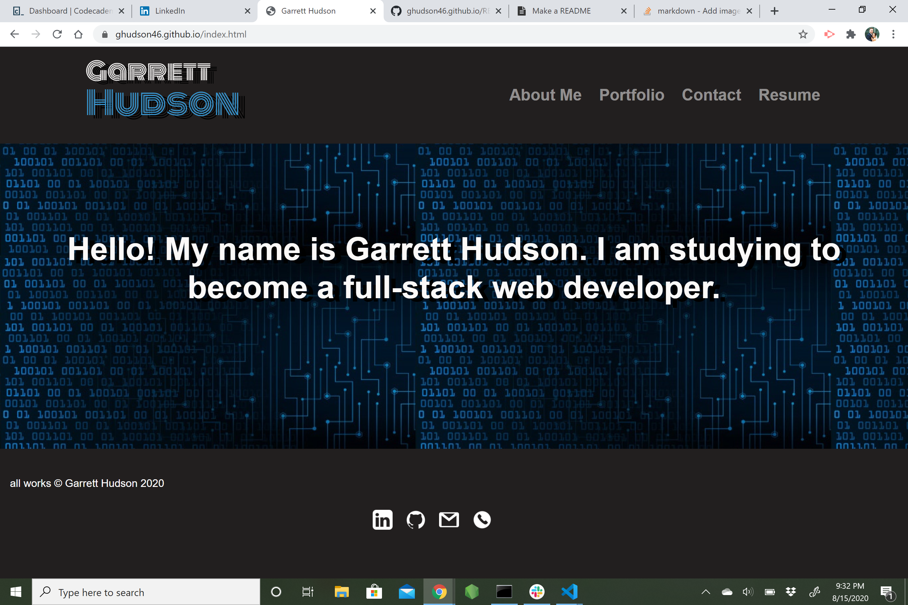
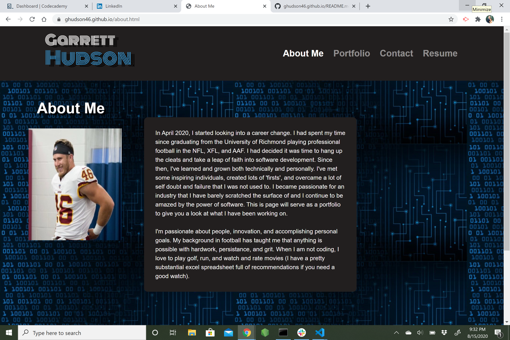
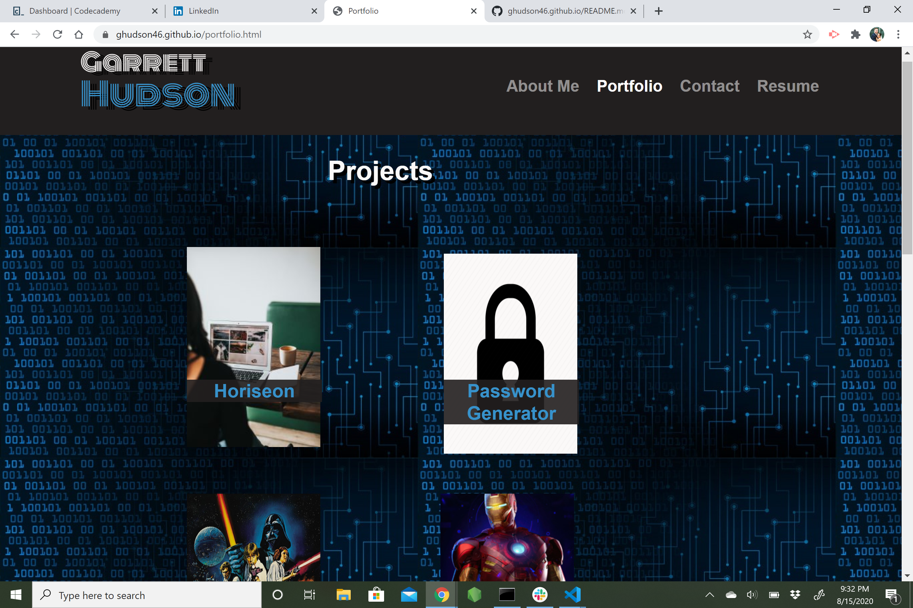
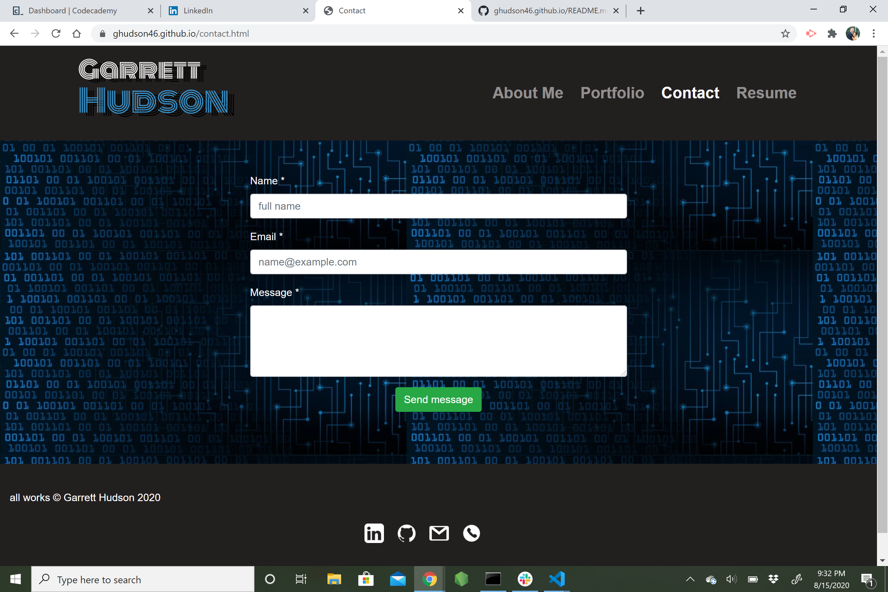
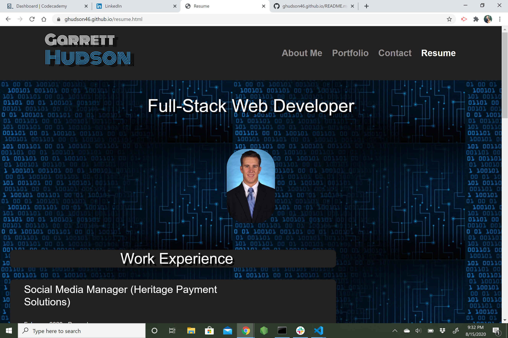

## Personal Portfolio
This website will serve as my professional portfolio. I created this repo to showcase my work for anybody who is interested, as well as document my coding journey. 

## links
https://ghudson46.github.io
https://github.com/ghudson46.github.io

## Technology used
HTML
CSS
Bootstrap

## images
Landing page 
About me 
Portfolio 
Contact 
Resume 
## License
[MIT](https://choosealicense.com/licenses/mit/)

## contact info
email: garrett.hudson46@gmail.com
phone: (919) 606-6599
